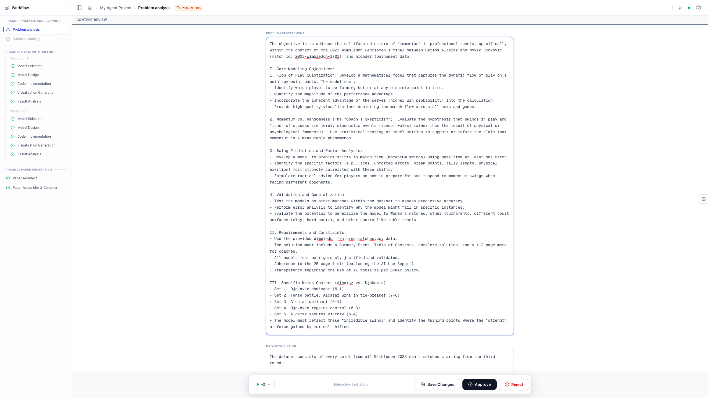
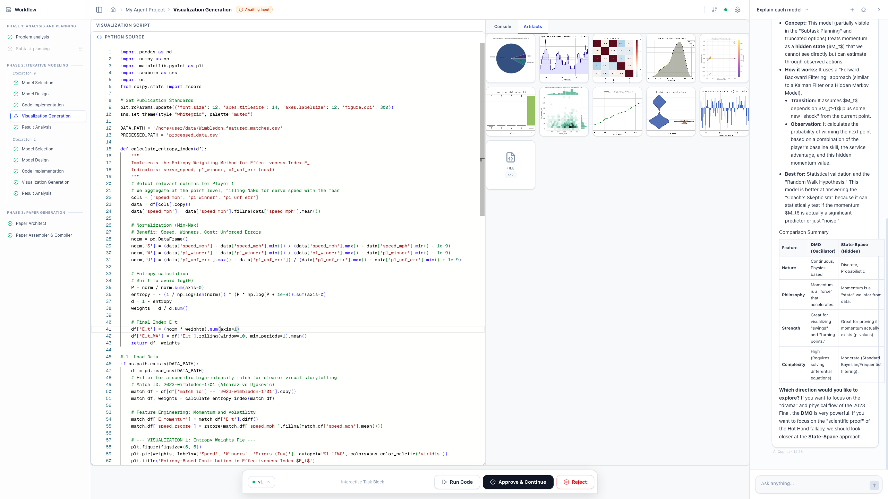
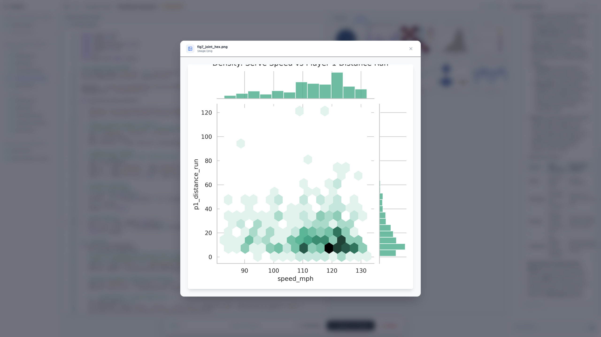
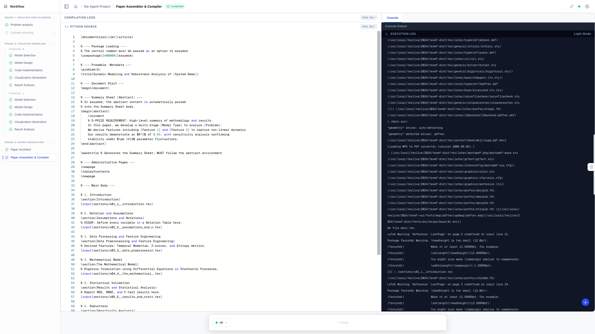
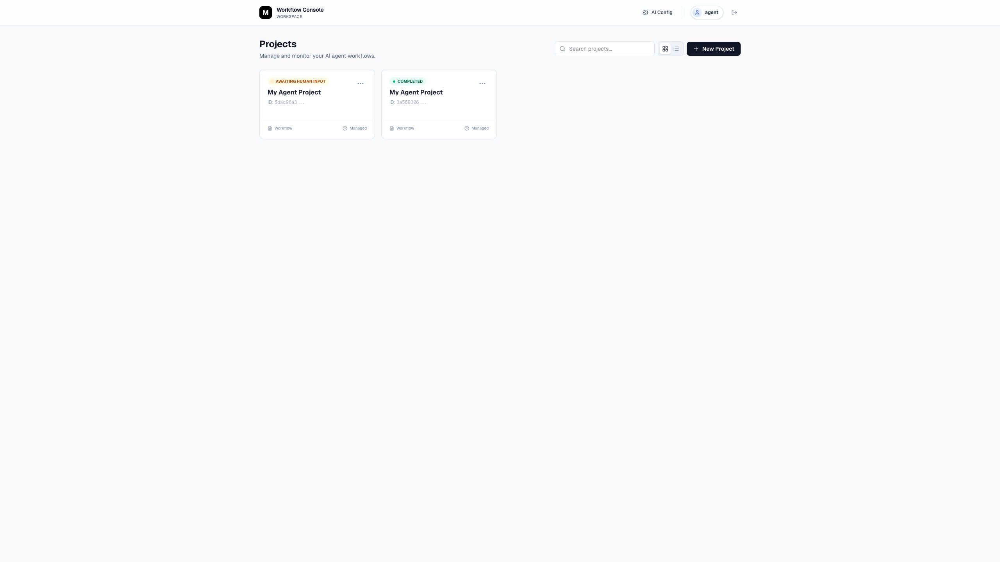

# MM Agent: LLMs as Agents for Real-world Mathematical Modeling Problems

[](https://www.python.org/downloads/)
[](https://pytorch.org/)
[](https://openai.com/)
[](LICENSE)
[](https://neurips.cc/)

<p align="center">
  <a href="#-quick-start"></a>
  &nbsp;&nbsp;
  <a href="#-core-features"></a>
  &nbsp;&nbsp;
  <a href="https://arxiv.org/abs/2505.14148"></a>
  &nbsp;&nbsp;
  <a href="https://github.com/usail-hkust/LLM-MM-Agent/stargazers"></a>
  &nbsp;&nbsp;
  
</p>

[English](README.md) · [中文版](README_zh.md)

---

<p align="center">
   
</p>

<div align="center">

🎯 **Mathematical Modeling Agent** &nbsp;•&nbsp; 📊 **Automated Problem Solving**<br>
🤖 **Intelligent Code Generation** &nbsp;•&nbsp; 📈 **End-to-End Workflow**

📄 [NeurIPS 2025 Paper](https://arxiv.org/abs/2505.14148) &nbsp;•&nbsp [💬 Join WeChat Group](#-contact--community) &nbsp;•&nbsp [⭐ Star Us](https://github.com/usail-hkust/LLM-MM-Agent/stargazers)

</div>

---

## 📰 News
1. **2026-01**
   ✨ **DSLIGHTING: 全流程数据科学智能助手 / End-to-End Data Science Intelligent Assistant**
   🌟 支持完整的数据科学工作流，数学建模场景专用优化 / Supports complete data science workflow with specialized optimization for mathematical modeling scenarios
   👉 访问 / Visit: [https://github.com/usail-hkust/dslighting](https://github.com/usail-hkust/dslighting)
2. **2025-12**
   🔥 **Upcoming Update**: We will soon release the latest upgraded version of the demo. Please **Star** 🌟 our repository! We will issue service accounts based on the Star list (due to limited server capacity) to help everyone better prepare for the MCM/ICM contest.
   (即将更新：我们将很快发布最新升级版演示。请 **Star** 🌟 我们的仓库！由于服务器容量有限，我们将根据 Star 列表发放服务账号，帮助大家更好的备战美赛。)
3. **2025-10**
   🚀 **MM-Agent assisted two undergraduate teams in winning the Finalist Award** (Top 2.0% among 27,456 teams) in **MCM/ICM 2025**, demonstrating its practical effectiveness as a *modeling copilot*.
   🔗 [在线体验 / Online Demo](https://huggingface.co/spaces/MathematicalModelingAgent/MathematicalModelingAgent)
4. **2025-09**
   🎉 Our paper *"MM-Agent: LLMs as Agents for Real-world Mathematical Modeling Problems"* has been accepted to the **NeurIPS 2025**!
   📄 [Read the paper on arXiv](https://arxiv.org/abs/2505.14148)
5. **2025-07**
   🎉 Our paper *"MM-Agent: LLMs as Agents for Real-world Mathematical Modeling Problems"* has been accepted to the **AI4MATH Workshop at ICML 2025**!
   📄 [Read the paper on arXiv](https://arxiv.org/abs/2505.14148)
6. **2026-01**
   🎉 **Latest Demo Now Live / 最新演示已上线**
   🚀 Experience our upgraded mathematical modeling platform! Join our WeChat group to get your invitation code for early access.
   欢迎加入我们的微信群获取邀请码，抢先体验升级后的数学建模平台！
   👉 访问 / Visit: [http://146.56.204.108:3000/](http://146.56.204.108:3000/)

---

## 📖 Overview

We propose **MM-Agent**, a mathematical modeling system that simulates the real-world human process of solving mathematical problems. Inspired by expert workflows, our agent systematically analyzes unstructured problem descriptions, formulates structured mathematical models, derives solutions through autonomous code generation, and generates comprehensive analytical reports.

Our paper has been accepted by **NeurIPS 2025** and is available on [arXiv](https://arxiv.org/abs/2505.14148).

## 🎥 Demo Video

[**▶️ Watch the Demo Video**](assets/demo.mp4)

> 💡 Note: Click the link above to watch the demo on GitHub.

## ⚡ Core Features

### 🎯 End-to-End Mathematical Modeling Workflow

MM-Agent simulates the complete human process of mathematical modeling:

1. **🧠 Problem Analysis** - Understand problem background, objectives, and constraints
2. **📐 Mathematical Modeling** - Formulate mathematical models with appropriate assumptions
3. **🧮 Computational Solving** - Implement algorithms and optimization techniques
4. **📝 Solution Reporting** - Generate structured reports with clear interpretations

### 🚀 Core Capabilities

- **Automated Model Selection** - Intelligently selects appropriate mathematical models
- **Interactive Data Analysis** - Execute complex analysis with visualizations
- **Intelligent Code Generation** - Auto-generate and iteratively improve code
- **Professional Paper Writing** - Generate academic-quality reports automatically
- **Project Management** - Track and manage multiple modeling projects efficiently

## 🎥 Demo Walkthrough

### 1. Project Creation
Initialize your modeling workspace effortlessly.


### 2. Upload Problem & Data
Simply upload your problem statement and datasets.


### 3. Automated Modeling
The agent intelligently selects and builds mathematical models.


### 4. Data Analysis
Execute complex data analysis and generate visualizations.


### 5. Paper Writing
Auto-generate professional reports and academic papers.


### 6. Project Management
Track and manage multiple modeling projects efficiently.


## 🖼️ Framework Overview

<div align="center">
   
</div>


---

## 🔬 Technical Details

### How MM-Agent Works

The agent simulates a real-world mathematical modeling workflow through four structured stages:

1. **🧠 Problem Analysis**
   - Understands problem background, objectives, data availability, and constraints
   - Decomposes complex problems into manageable subtasks

2. **📐 Mathematical Modeling**
   - Translates real-world problems into mathematical models
   - Uses appropriate assumptions, formulations, and modeling techniques
   - Retrieves suitable methods from the Hierarchical Mathematical Modeling Library (HMML)

3. **🧮 Computational Solving**
   - Implements algorithms, simulations, and optimization techniques
   - Autonomously generates and iteratively improves code using MLE-Solver
   - Ensures efficient and accurate execution

4. **📝 Solution Reporting**
   - Summarizes the full modeling process
   - Interprets results and generates clear, structured reports

### Key Innovation: HMML

**Hierarchical Mathematical Modeling Library (HMML)** - A tri-level knowledge hierarchy encompassing:
- **Domains** - High-level modeling categories
- **Subdomains** - Specialized modeling areas
- **Method Nodes** - 98 high-level modeling schemas

HMML enables both problem-aware and solution-aware retrieval of modeling strategies, supporting abstraction and method selection through an actor-critic mechanism.

---
## 🌐 Demo
Our demo is available at [Hugging Face Spaces](https://huggingface.co/spaces/MathematicalModelingAgent/MathematicalModelingAgent).

## 👾 Currently Supported Models

* **OpenAI**: `gpt-4o`
* **DeepSeek**: `deepseek-R1`

---

## 🚀 Quick Start

### 🔧 Running the Agent

You can directly run the Mathematical Modeling Agent with:

```bash
python MMAgent/main.py --key "your_openai_key" --task "task_id"
```

**Example**:

```bash
python MMAgent/main.py --key "sk-XXX" --task "2024_C"
```

Here, `task` corresponds to the problem ID from MM-Bench (e.g., `"2024_C"` refers to the 2024 MCM problem C).

---

## 🖥️ Installation Guide

### ✅ Prerequisites

* Python 3.10 recommended
* Conda (optional but preferred)

### 💻 Setup Steps

1. **Clone the Repository**

```bash
git clone git@github.com:usail-hkust/LLM-MM-Agent.git
```

2. **Create and Activate the Conda Environment**

```bash
conda create --name math_modeling python=3.10
conda activate math_modeling
```

3. **Navigate to Project Directory**

```bash
cd MM-Agent
```

4. **Install Dependencies**

```bash
pip install -r requirements.txt
```

---

## 🤝 Contact & Community

<div align="center">

**Join our WeChat group for updates and service support!**


For questions and discussions, welcome to:
- 💬 WeChat Group: Scan the QR code above
- 📧 Email: [Contact Us](mailto:contact@mm-agent.ai)
- ⭐ Star us on GitHub and stay tuned!

</div>

---

## 📜 License

Source code is licensed under the **[CC BY-NC 4.0](LICENSE)**.

---

## 🌟 More Exciting Projects

<div align="center">

If you find this project helpful, feel free to explore more of our work!

🔥 **[DSLIGHTING](https://github.com/usail-hkust/dslighting)** - End-to-End Data Science Intelligent Assistant

**More Projects:** [usail-hkust](https://github.com/usail-hkust)

</div>

---

## ⭐ Star History

<div align="center">

[](https://github.com/usail-hkust/LLM-MM-Agent/stargazers)

[](https://github.com/usail-hkust/LLM-MM-Agent/network/members)

[](https://star-history.com/#usail-hkust/LLM-MM-Agent&Date)

</div>

---

## 📚 References

```bash
@misc{mmagent,  
   title={MM-Agent: LLM as Agents for Real-world Mathematical Modeling Problem},  
   author={Fan Liu and Zherui Yang and Cancheng Liu and Tianrui Song and Xiaofeng Gao and Hao Liu},  
   year={2025},  
   eprint={2505.14148},  
   archivePrefix={arXiv},  
   primaryClass={cs.AI},  
   url={https://arxiv.org/abs/2505.14148}  
}
```