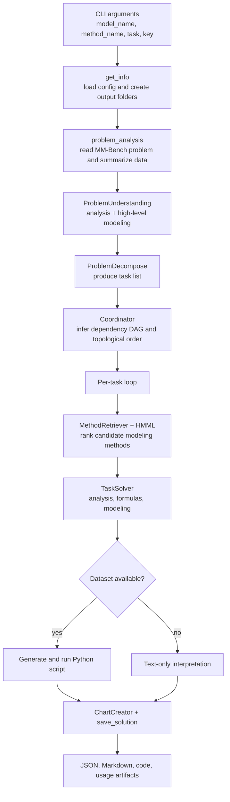

# MM-Agent Documentation

MM-Agent is a compact but multi-stage agent runtime for real-world mathematical modeling. One run does much more than call an LLM once: it builds a problem brief, decomposes the work into subtasks, retrieves candidate modeling methods from HMML, generates formulas and code, executes scripts, creates charts, and saves report-ready artifacts.

> These notes are intentionally grounded in source code, not just the project README.

## The 30-second mental model

## What is hard-coded and what is generated

**Hard-coded in the repository**

- CLI entry, config loading, and output folder layout.
- Task scheduling through a dependency DAG.
- HMML loading and hierarchical retrieval.
- Script execution, retry logic, and artifact persistence.
- MM-Bench evaluation scripts and score aggregation.

**Generated at runtime by the LLM**

- Problem analysis and modeling narrative.
- Task decomposition text.
- Task-specific formulas.
- Python code for computational solving.
- Chart descriptions and optional paper chapters.

This split matters: MM-Agent does **not** hard-code one universal mathematical model for every contest problem. Instead, it hard-codes the **workflow that chooses and instantiates** models.

## Recommended reading order

1. [Quick start](quick-start.md) for installation and the shortest path to a run.
2. [Architecture](architecture.md) for the macro picture.
3. [Workflow deep dive](workflow.md) for exact execution order.
4. [Math and algorithms](math-theory.md) for the formulas that really exist in code.
5. [Source guide](source-guide.md) when you want to read the implementation efficiently.
6. [Evaluation](evaluation.md) if you care about benchmark scoring and reproducibility.

## A good beginner question to keep in mind

If you only remember one sentence, remember this one:

> MM-Agent is a **workflow engine for mathematical modeling**, not a single monolithic solver.

## Primary source anchors

- [`../../MMAgent/main.py`](../../MMAgent/main.py)
- [`../../MMAgent/utils/problem_analysis.py`](../../MMAgent/utils/problem_analysis.py)
- [`../../MMAgent/utils/mathematical_modeling.py`](../../MMAgent/utils/mathematical_modeling.py)
- [`../../MMAgent/utils/computational_solving.py`](../../MMAgent/utils/computational_solving.py)
- [`../../MMAgent/agent/retrieve_method.py`](../../MMAgent/agent/retrieve_method.py)
- [`../../MMAgent/agent/task_solving.py`](../../MMAgent/agent/task_solving.py)
- [`../../MMAgent/HMML/HMML.md`](../../MMAgent/HMML/HMML.md)
