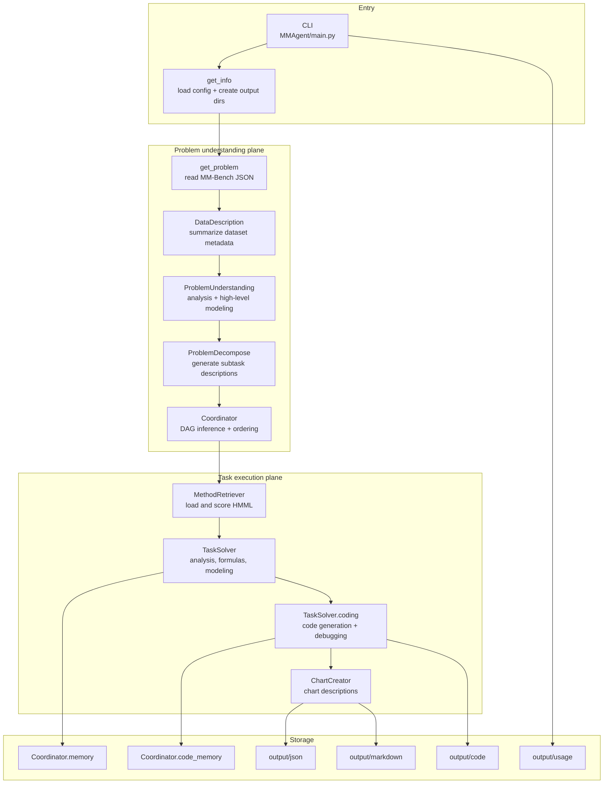

# Architecture Deep Dive

This page answers one question: **what are the real moving parts of MM-Agent, and how do they cooperate?**

## 1. Macro architecture

## 2. The six architectural subsystems

| Subsystem | Main files | Responsibility |
| --- | --- | --- |
| CLI and orchestration | `MMAgent/main.py` | Build the run, iterate over ordered tasks, persist usage |
| Problem understanding | `utils/problem_analysis.py`, `agent/problem_analysis.py`, `agent/problem_decompse.py` | Convert one MM-Bench problem into analysis + task list |
| Dependency scheduling | `agent/coordinator.py` | Infer a dependency DAG and compute topological order |
| Method retrieval | `agent/retrieve_method.py`, `HMML/HMML.md` | Rank modeling candidates from a hierarchical method library |
| Task execution | `utils/mathematical_modeling.py`, `utils/computational_solving.py`, `agent/task_solving.py` | Produce formulas, modeling text, code, results, and charts |
| Evaluation | `MMBench/evaluation/*.py` | Judge solution quality with LLM-based rubrics |

## 3. Control plane vs data plane

### Control plane

The control plane is the logic that decides **what to do next**:

- how many tasks to create,
- which tasks depend on which,
- which modeling methods are worth considering,
- whether code generation is required,
- when to retry or debug a script.

### Data plane

The data plane is the material that gets moved through the system:

- MM-Bench problem JSON,
- dataset metadata and dataset files,
- generated task descriptions,
- generated formulas and scripts,
- execution outputs,
- saved JSON/Markdown artifacts.

A useful mental shortcut:

> The control plane decides the **workflow**, and the data plane carries the **problem-specific content**.

## 4. In-memory state that matters most

The `Coordinator` object is the run's lightweight state manager.

It owns three pieces of state:

- `DAG`: task dependencies.
- `memory`: textual outputs for each completed task.
- `code_memory`: code structure and file-output summaries for each task.

This design makes later tasks dependency-aware without introducing a database or a separate workflow engine.

## 5. Why the architecture feels agentic

MM-Agent feels like an agent because multiple loops are layered together:

- problem analysis can critique and improve itself,
- modeling formulas can critique and improve themselves,
- generated code can be retried and debugged,
- charts are generated iteratively with awareness of previously produced charts.

So the architecture is not just a pipeline; it is a pipeline with **embedded refinement loops**.

## 6. Operational constraints hidden in the code

These are easy to miss if you only read the README:

- Code execution is launched with `CUDA_VISIBLE_DEVICES=0`, so generated scripts are steered to a single visible GPU slot by default.
- The default configuration is intentionally small: `tasknum=4`, `top_method_num=6`, `chart_num=3`.
- The optional paper-generation stage exists, but the call is commented out in `main.py`.
- The runtime is fundamentally single-run and in-memory; there is no long-lived service or job queue in this repository.

## 7. A practical summary

If you are trying to modify MM-Agent safely, think in this order:

1. **Entry and output layout** (`main.py`, `utils.py`)
2. **Problem decomposition** (`problem_analysis.py`, `problem_decompse.py`)
3. **Scheduling and retrieval** (`coordinator.py`, `retrieve_method.py`)
4. **Task solving and code execution** (`task_solving.py`, `computational_solving.py`)
5. **Evaluation** (`MMBench/evaluation/`)

## Primary source anchors

- [`../../MMAgent/main.py`](../../MMAgent/main.py)
- [`../../MMAgent/utils/problem_analysis.py`](../../MMAgent/utils/problem_analysis.py)
- [`../../MMAgent/utils/mathematical_modeling.py`](../../MMAgent/utils/mathematical_modeling.py)
- [`../../MMAgent/utils/computational_solving.py`](../../MMAgent/utils/computational_solving.py)
- [`../../MMAgent/agent/coordinator.py`](../../MMAgent/agent/coordinator.py)
- [`../../MMAgent/agent/retrieve_method.py`](../../MMAgent/agent/retrieve_method.py)
- [`../../MMAgent/agent/task_solving.py`](../../MMAgent/agent/task_solving.py)
