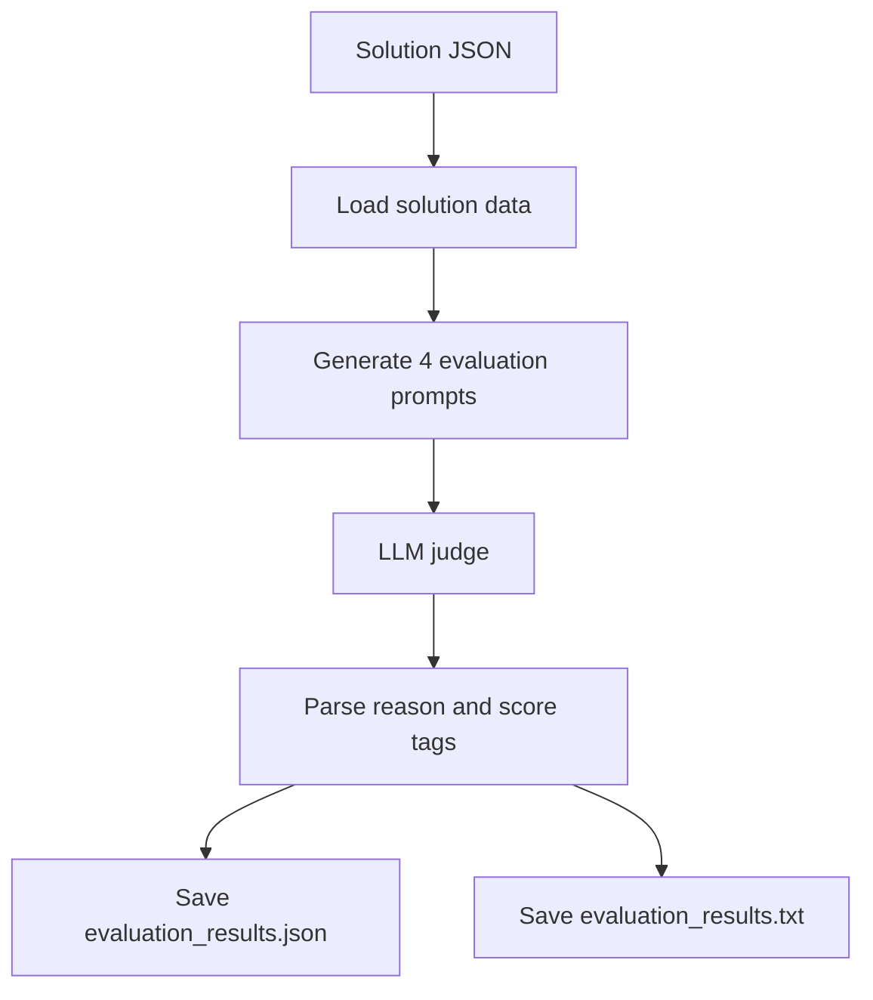
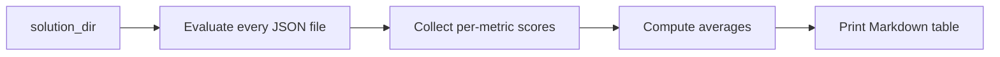

# Evaluation and MM-Bench

MM-Agent ships with a benchmark companion named **MM-Bench**. This page explains how the benchmark is organized and how the repository evaluates generated solutions.

## 1. What MM-Bench contains

According to `MMBench/README.md`, the benchmark contains four major directories:

- `problem/`: contest problems stored as JSON.
- `dataset/`: supporting datasets.
- `evaluation/`: scripts that judge solution files.
- `example_solution/`: example outputs.

## 2. Problem JSON schema

A problem JSON may include:

- `background`
- `problem_requirement`
- `dataset_path`
- `dataset_description`
- `variable_description`
- `addendum`

This schema is the bridge between benchmark storage and agent execution.

## 3. Single-file evaluation flow



The single-file script generates four evaluation prompts covering:

- problem analysis quality,
- modeling rigorousness,
- practicality and scientificity,
- result and bias analysis.

## 4. How scores are extracted

The parser searches the LLM output for tagged blocks:

- `<reason> ... </reason>`
- `<score> ... </score>`

If the number of reasons and scores does not match, the parser returns an empty dictionary for that section.

This makes the evaluation pipeline simple, but it also means prompt formatting matters a lot.

## 5. Batch evaluation flow

`run_evaluation_batch.py` iterates over all solution JSON files in a directory, evaluates each one, then computes average scores per metric.



The final printed table includes:

- Analysis Evaluation
- Modeling Rigorousness
- Practicality and Scientificity
- Result and Bias Analysis

## 6. Commands you will actually use

Evaluate one file:

```bash
python MMBench/evaluation/run_evaluation.py \
  --solution_file_path "MMBench/example_solution/example1.json" \
  --key "sk-..."
```

Evaluate one folder:

```bash
python MMBench/evaluation/run_evaluation_batch.py \
  --solution_dir "MMBench/example_solution" \
  --key "sk-..."
```

## 7. Where the results go

For a solution file named `foo.json`, the scripts create:

```text
<solution_dir>/evaluation_result/foo/
|- evaluation_results.json
`- evaluation_results.txt
```

The JSON file is easier for downstream analysis; the TXT file preserves the full judge narratives.

## 8. How to interpret the benchmark philosophy

MM-Bench is not only checking whether the final answer sounds plausible. It tries to score the full modeling process:

- was the problem understood correctly?
- is the modeling rigorous?
- is the solution practical and scientifically sound?
- are the results analyzed with awareness of bias and limitations?

That is a good fit for MM-Agent because MM-Agent itself is designed as a staged reasoning pipeline rather than a one-line answer machine.

## 9. Limitations to remember

- The evaluator is itself LLM-based, so some variance is unavoidable.
- Formatting assumptions matter because parsing depends on explicit XML-like tags.
- Average scores summarize trends, but they do not replace reading the judge's written reasons.

## Primary source anchors

- [`../../MMBench/README.md`](../../MMBench/README.md)
- [`../../MMBench/evaluation/run_evaluation.py`](../../MMBench/evaluation/run_evaluation.py)
- [`../../MMBench/evaluation/run_evaluation_batch.py`](../../MMBench/evaluation/run_evaluation_batch.py)
