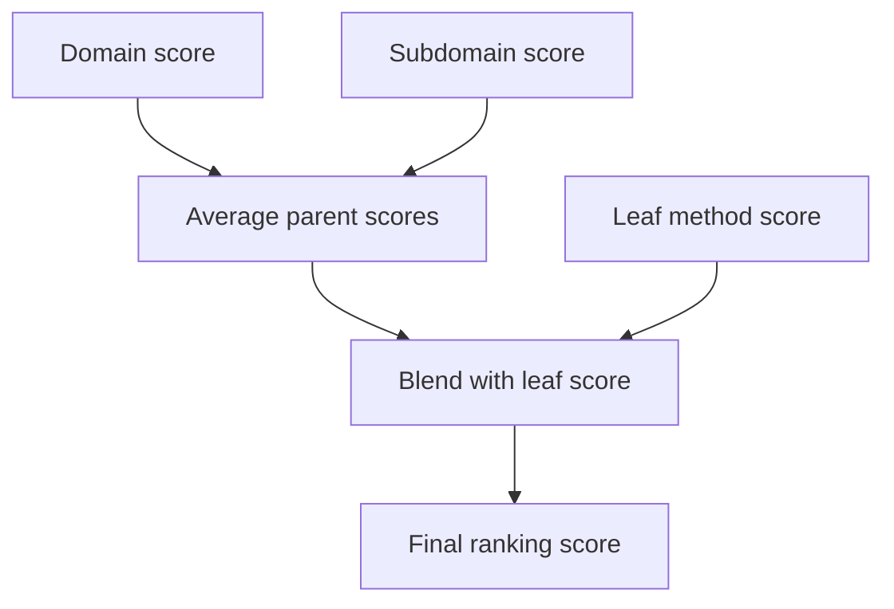
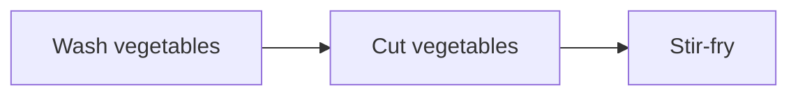

# Math and Algorithms Behind the Runtime

This page focuses on the formulas and algorithmic logic that are **actually implemented in code**.

A crucial warning first:

> MM-Agent does **not** hard-code one grand mathematical model for all MCM/ICM problems.

The domain formulas for a task are generated by the LLM at runtime. The fixed math in the repository lives mostly in the **meta-layer**: retrieval, scheduling, and evaluation.

## 1. HMML scoring: "family background" plus "today's performance"

In `MethodScorer`, a leaf method is scored by blending parent scores with the current child score.

$$
\text{final\_score} = \alpha \cdot \text{parent\_avg} + \beta \cdot \text{child\_score}
$$

with default weights:

$$
\alpha = 0.5, \qquad \beta = 0.5
$$

### What the symbols mean

- `parent_avg`: how strong the higher-level categories look.
- `child_score`: how well the current concrete method matches the task.
- `final_score`: the blended score used for ranking leaf methods.

### Ultra-simple numeric example

Imagine you are choosing a fruit stall.

- The whole market section has a reputation score of `80`.
- The "citrus" aisle inside it has a score of `70`.
- A specific orange stall has a freshness score of `90`.

Then the parent average is:

$$
\text{parent\_avg} = \frac{80 + 70}{2} = 75
$$

Final score:

$$
\text{final\_score} = 0.5 \times 75 + 0.5 \times 90 = 82.5
$$

Intuition: the stall wins not only because today's oranges look good, but also because it sits in a strong neighborhood of methods.

## 2. Embedding retrieval: cosine similarity in plain language

`EmbeddingScorer` compares the task description to candidate methods by embedding them into vectors and measuring directional alignment.

The conceptual formula is cosine similarity:

$$
\cos(\theta) = \frac{q \cdot m}{\|q\|\,\|m\|}
$$

where:

- $q$ is the query embedding,
- $m$ is a method embedding,
- the dot product checks whether the two vectors point in a similar direction.

The code normalizes embeddings first, then computes a scaled dot product.

### Everyday analogy

Think of two arrows on a table:

- if they point in the same direction, similarity is close to `1`,
- if they point at right angles, similarity is close to `0`,
- if they point in opposite directions, similarity becomes negative.

Tiny example:

$$
q = (3,4), \qquad m = (6,8)
$$

They are perfectly aligned, so cosine similarity is `1`.

## 3. DAG ordering: do prerequisites before consequences

`Coordinator.compute_dag_order()` implements topological sorting.

The code counts each node's indegree:

$$
\text{indegree}(v) = \text{number of prerequisites of task } v
$$

Then it repeatedly picks tasks whose indegree is zero.

### Everyday analogy

Suppose dinner has three steps:

1. wash vegetables,
2. cut vegetables,
3. stir-fry.

You cannot stir-fry before cutting. The DAG is just the formal version of this common sense.

If the graph contains a cycle, there is no valid order. The code raises a `ValueError` in that case.

## 4. Critique-improve loops: iterative refinement, not one-shot generation

Several classes follow the same abstract update pattern:

$$
x_{t+1} = \operatorname{Improve}(x_t, \operatorname{Critique}(x_t))
$$

Here:

- $x_t$ is the current draft,
- `Critique` judges weaknesses,
- `Improve` rewrites the draft using that critique.

This pattern appears in:

- problem analysis,
- high-level modeling,
- task formulas.

In ordinary language: MM-Agent deliberately gives itself a second and third chance to think.

## 5. Code execution loop: bounded search through program space

The code path is also iterative.

A rough abstraction is:

$$
\text{best\_program} = \operatorname{Debug}^k(\operatorname{Generate}(\text{prompt}))
$$

subject to bounded attempts:

- outer tries up to `5`,
- inner debug iterations up to `3`.

This is not a formal optimizer, but operationally it behaves like a bounded search over nearby program variants.

## 6. Evaluation averaging: many judges, one scoreboard

In batch evaluation, the script collects scores from four categories and averages them.

The generic mean is:

$$
\bar{s} = \frac{1}{n}\sum_{i=1}^{n} s_i
$$

Ultra-simple example:

If a baseline scores `7, 8, 6, 9`, then:

$$
\bar{s} = \frac{7+8+6+9}{4} = 7.5
$$

This is the mathematical equivalent of asking several teachers to grade the same assignment and then taking the average.

## 7. The most important conceptual takeaway

The repository's fixed mathematics is mostly about **choosing, ordering, and validating modeling actions**.

The domain mathematics for a specific contest problem is mostly produced at runtime from prompts plus HMML retrieval.

That is why MM-Agent feels flexible across different problems: it fixes the **decision framework**, not the final formula sheet.

## Primary source anchors

- [`../../MMAgent/agent/retrieve_method.py`](../../MMAgent/agent/retrieve_method.py)
- [`../../MMAgent/utils/embedding.py`](../../MMAgent/utils/embedding.py)
- [`../../MMAgent/agent/coordinator.py`](../../MMAgent/agent/coordinator.py)
- [`../../MMAgent/agent/problem_analysis.py`](../../MMAgent/agent/problem_analysis.py)
- [`../../MMAgent/agent/task_solving.py`](../../MMAgent/agent/task_solving.py)
- [`../../MMBench/evaluation/run_evaluation_batch.py`](../../MMBench/evaluation/run_evaluation_batch.py)
