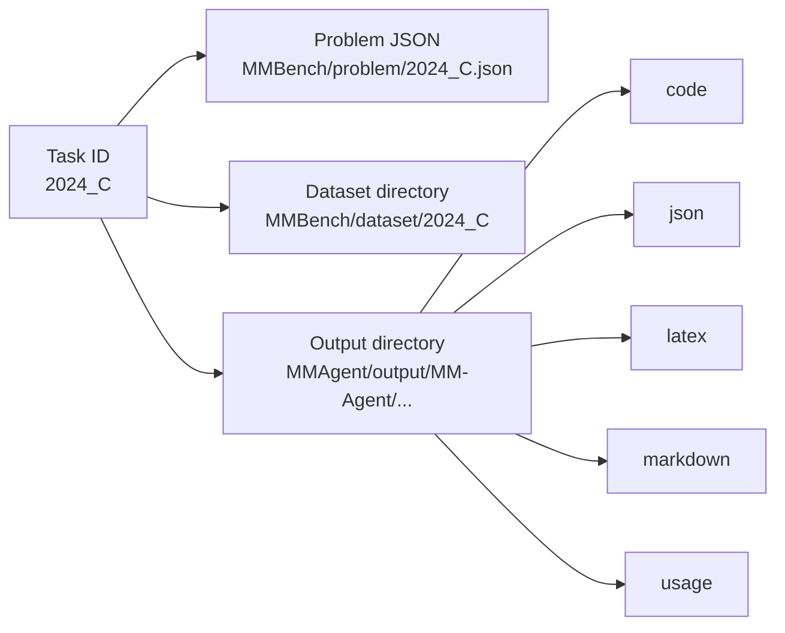

# Quick Start

This page is for the fastest possible path from clone to a valid MM-Agent run.

## 1. Install dependencies

The repository README recommends Python 3.10 and an optional Conda environment.

```bash
uv sync --project .
```

## 2. Start the local middleware

The agent expects a standard OpenAI-compatible `/v1` endpoint. Start the bundled middleware first:

```bash
cd openai_compat_middleware
uv sync
cp .env.example .env
uv run openai-compat-middleware
```

Then return to repository root for agent execution.

## 3. Run from the repository root

Run commands from the repository root, not from inside `MMAgent/`.

Why? Several paths are assembled as repository-relative strings, such as:

- `MMBench/problem/{task}.json`
- `MMBench/dataset/{task}`
- `MMAgent/output/{method_name}/{task}_{timestamp}`
- `MMAgent/code_template/main{task_id}.py`

## 4. Minimal command

```bash
uv run --project . python MMAgent/main.py --key "YOUR_API_KEY" --task "2024_C"
```

Example with explicit defaults:

```bash
uv run --project . python MMAgent/main.py \
  --key "sk-..." \
  --task "2024_C" \
  --model_name "gpt-5.4" \
  --method_name "MM-Agent"
```

## 5. What each CLI argument means

| Argument | Default | Meaning |
| --- | --- | --- |
| `--model_name` | `gpt-5.4` | The chat-completions model used by `LLM` |
| `--method_name` | `MM-Agent` | Output namespace under `MMAgent/output/` |
| `--task` | `2024_C` | Problem ID under `MMBench/problem/` |
| `--key` | empty string | API key passed into the LLM wrapper |

If `--key` is empty, the LLM wrapper raises a `ValueError`.

## 6. API base selection logic

`MMAgent/llm/llm.py` reads:

- `OPENAI_API_BASE` (recommended: `http://127.0.0.1:4010/v1` for local middleware).
- If unset, it defaults to `https://api.openai.com/v1`.

In plain English: **the agent always speaks standard OpenAI-compatible API; custom routing belongs in middleware config.**

## 7. What happens on disk during one run

`get_info()` creates a timestamped output directory and `mkdir()` populates the following subfolders:

```text
MMAgent/output/MM-Agent/2024_C_YYYYMMDD-HHMMSS/
|- code/
|- json/
|- latex/
|- markdown/
`- usage/
```



Notes:

- If the problem lists datasets, the dataset directory is copied into `output/code/` before task solving.
- `latex/` exists even if the optional paper-generation stage is not enabled.
- Usage statistics and runtime are written under `usage/`.

## 8. What a successful run prints conceptually

The runtime logs stage boundaries like:

- Stage 1: Problem Analysis
- Stage 2 & 3: Mathematical Modeling & Computational Solving
- Per-task solving banners
- Final solution text and token usage

This makes the terminal feel like a small pipeline runner rather than a single prompt-response tool.

## 9. Evaluate a generated solution

Single solution:

```bash
uv run --project . python MMBench/evaluation/run_evaluation.py \
  --solution_file_path "path/to/solution.json" \
  --key "YOUR_API_KEY"
```

Batch evaluation:

```bash
uv run --project . python MMBench/evaluation/run_evaluation_batch.py \
  --solution_dir "path/to/solution_dir" \
  --key "YOUR_API_KEY"
```

## 10. Troubleshooting checklist

- If imports fail, confirm you are running from the repository root.
- If the LLM call fails immediately, check `--key` and the relevant API base environment variable.
- If code generation succeeds but execution fails, inspect files under `output/code/`.
- If no dataset exists for a task, MM-Agent can still produce text reasoning, but the code path is skipped.

## Primary source anchors

- [`../../README.md`](../../README.md)
- [`../../MMAgent/main.py`](../../MMAgent/main.py)
- [`../../MMAgent/utils/utils.py`](../../MMAgent/utils/utils.py)
- [`../../MMAgent/llm/llm.py`](../../MMAgent/llm/llm.py)
- [`../../MMBench/README.md`](../../MMBench/README.md)
