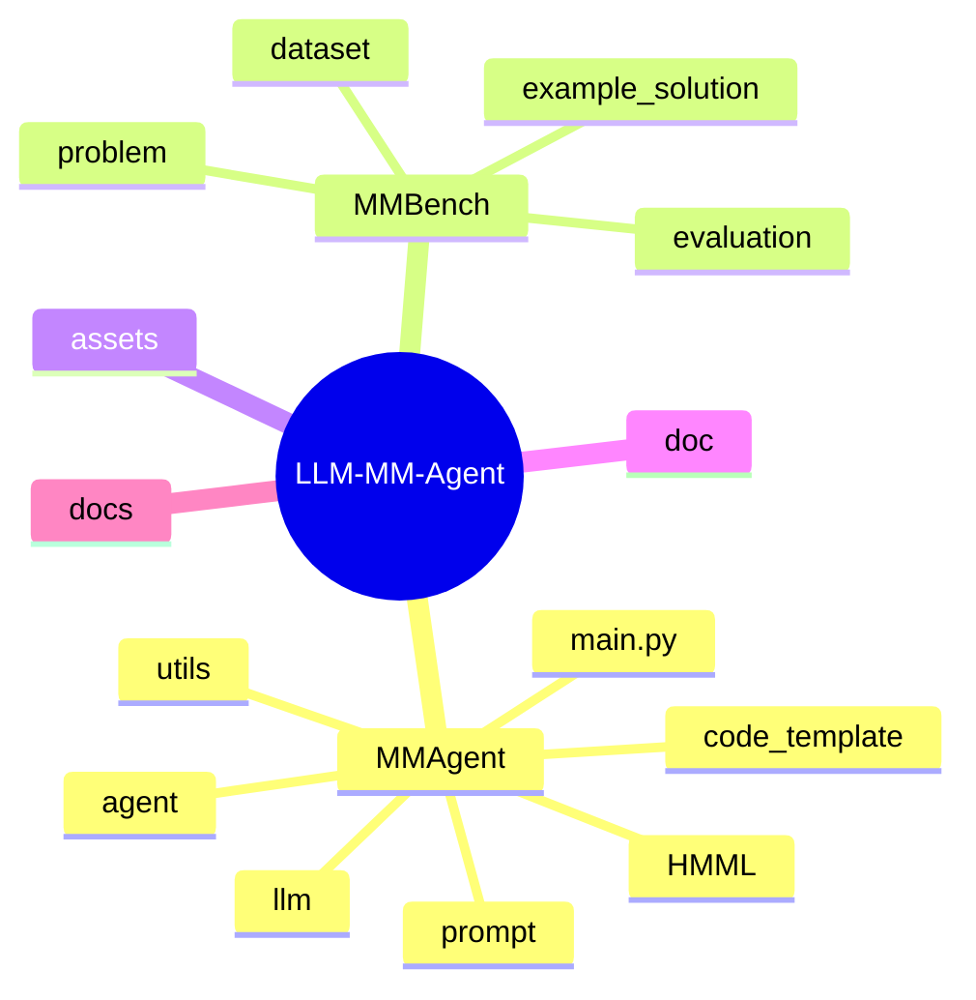

# Source Guide for Engineers and Researchers

If you want to read the repository efficiently, do **not** start randomly. Start from the orchestration spine, then branch outward.

## 1. Directory map

## 2. Read in this order

| Order | File or directory | Why it matters |
| --- | --- | --- |
| 1 | `MMAgent/main.py` | The shortest path to the full execution story |
| 2 | `MMAgent/utils/utils.py` | Explains config loading, output paths, and persistence |
| 3 | `MMAgent/utils/problem_analysis.py` | Shows how a contest problem becomes a structured brief |
| 4 | `MMAgent/agent/problem_analysis.py` | Reveals the actor-critic analysis loops |
| 5 | `MMAgent/agent/problem_decompse.py` | Shows how tasks are produced and refined |
| 6 | `MMAgent/agent/coordinator.py` | Dependency reasoning and DAG ordering |
| 7 | `MMAgent/utils/mathematical_modeling.py` | Connects dependencies, retrieval, and task modeling |
| 8 | `MMAgent/agent/retrieve_method.py` + `MMAgent/HMML/HMML.md` | The retrieval core and the modeling knowledge library |
| 9 | `MMAgent/agent/task_solving.py` | The biggest implementation hotspot: formulas, code, debugging, result writing |
| 10 | `MMAgent/utils/computational_solving.py` | The per-task artifact assembly point |
| 11 | `MMAgent/utils/solution_reporting.py` | Optional paper-generation subsystem |
| 12 | `MMBench/README.md` and `MMBench/evaluation/` | Benchmark schema and scoring pipeline |

## 3. Which file answers which question?

| Question | Best file |
| --- | --- |
| How do I launch a run? | `MMAgent/main.py` |
| Where do outputs go? | `MMAgent/utils/utils.py` |
| How is the problem prompt built? | `MMAgent/utils/problem_analysis.py` |
| How are subtasks created? | `MMAgent/agent/problem_decompse.py` |
| How are dependencies inferred? | `MMAgent/agent/coordinator.py` |
| How are methods retrieved from HMML? | `MMAgent/agent/retrieve_method.py` |
| Where is generated code executed? | `MMAgent/agent/task_solving.py` |
| How are JSON and Markdown artifacts saved? | `MMAgent/utils/utils.py` |
| How is evaluation done? | `MMBench/evaluation/run_evaluation.py` |

## 4. Three especially important design files

### `MMAgent/agent/task_solving.py`

This file is where the repository becomes "real" rather than aspirational. It contains:

- task analysis,
- formula generation,
- modeling generation,
- code generation,
- debugging,
- execution,
- result interpretation.

If you only have time to inspect one non-entry file, inspect this one.

### `MMAgent/agent/retrieve_method.py`

This file explains why MM-Agent is not a free-form prompt hack. HMML retrieval provides an explicit structure for method selection.

### `MMAgent/utils/solution_reporting.py`

This file shows the project's bigger ambition: not only solving the problem, but also writing a paper-like report from structured outputs.

## 5. Reading strategies for different goals

### If you want to run experiments

Read:

1. `README.md`
2. `MMAgent/main.py`
3. `MMAgent/utils/utils.py`
4. `MMBench/README.md`

### If you want to modify retrieval

Read:

1. `MMAgent/HMML/HMML.md`
2. `MMAgent/agent/retrieve_method.py`
3. `MMAgent/utils/embedding.py`

### If you want to improve generated code quality

Read:

1. `MMAgent/agent/task_solving.py`
2. `MMAgent/code_template/`
3. `MMAgent/utils/computational_solving.py`

### If you want to improve final reporting

Read:

1. `MMAgent/utils/solution_reporting.py`
2. `MMAgent/utils/utils.py`
3. prompt files under `MMAgent/prompt/`

## 6. One final tip

The repository is easier to understand if you mentally split it into two halves:

- **runtime orchestration** (`MMAgent/`)
- **benchmark and judging** (`MMBench/`)

Everything else is support structure.

## Primary source anchors

- [`../../MMAgent/main.py`](../../MMAgent/main.py)
- [`../../MMAgent/utils/utils.py`](../../MMAgent/utils/utils.py)
- [`../../MMAgent/agent/task_solving.py`](../../MMAgent/agent/task_solving.py)
- [`../../MMAgent/agent/retrieve_method.py`](../../MMAgent/agent/retrieve_method.py)
- [`../../MMAgent/utils/solution_reporting.py`](../../MMAgent/utils/solution_reporting.py)
- [`../../MMBench/README.md`](../../MMBench/README.md)
