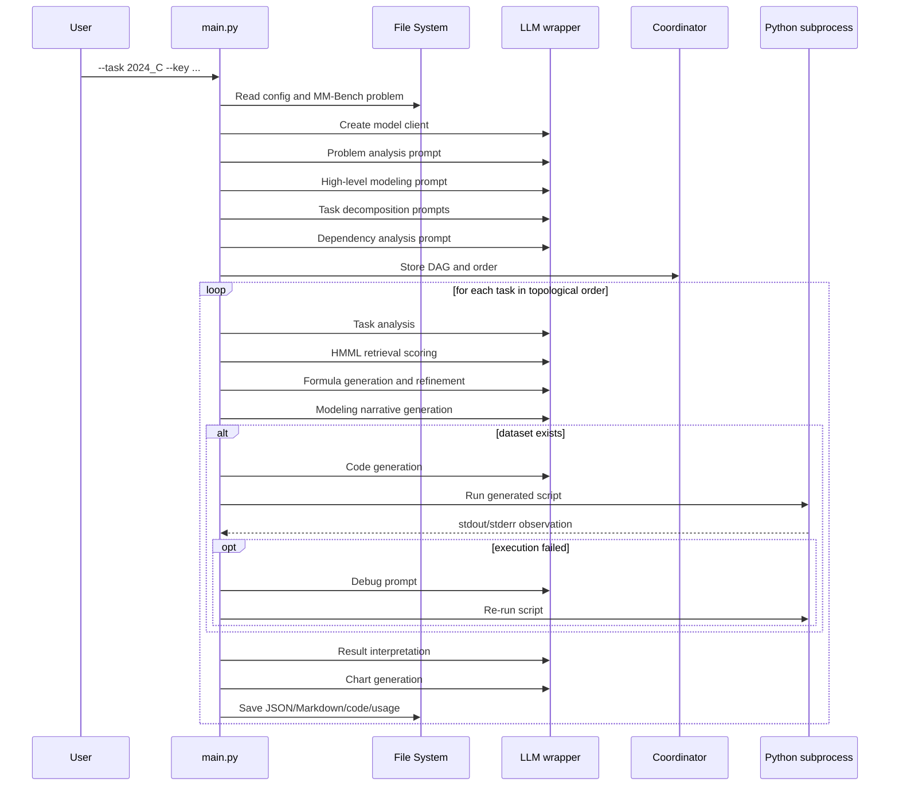

# Execution Workflow, End to End

This page follows one run from `python MMAgent/main.py ...` all the way to saved artifacts.

## 1. Stage map



## 2. Stage 0: normalize inputs

`parse_arguments()` accepts four arguments, then `get_info()` derives everything else.

In particular, `get_info()` computes:

- the problem file path,
- the dataset directory,
- the output directory name, including a timestamp,
- the folder skeleton used by later stages.

This means the CLI input is small, but the runtime context becomes rich very quickly.

## 3. Stage 1: build a machine-readable problem brief

`get_problem()` loads one MM-Bench JSON file and turns several fields into a single prompt-ready string:

- `background`
- `problem_requirement`
- `addendum`
- dataset summary if dataset metadata exists

If a dataset description is present, `DataDescription.summary()` asks the LLM to compress raw field descriptions into a more useful summary. In other words, the runtime first converts a contest statement into something closer to a consultant's project brief.

## 4. Stage 2: understand the problem before splitting it

`ProblemUnderstanding` runs two major steps:

1. `analysis()`
2. `modeling()`

Both use an actor -> critic -> improvement pattern. The important design choice is that MM-Agent does **not** jump directly into coding. It first creates a high-level understanding of the problem's structure.

## 5. Stage 3: decompose the contest problem into subtasks

`ProblemDecompose.decompose_and_refine()` first produces rough subtasks and then refines each one individually.

The decomposition principle depends on the problem type and the configured task count. That is why the repository carries `decompose_prompt.json`: task splitting is itself part of the encoded modeling know-how.

## 6. Stage 4: infer dependencies and execution order

`Coordinator.analyze_dependencies()` asks the LLM for dependency analysis, tries to parse a DAG, and computes a topological order.

If parsing fails repeatedly, the code falls back to a simple chain-like DAG:

- Task 1 depends on nothing.
- Task 2 depends on Task 1.
- Task 3 depends on Tasks 1 and 2.
- and so on.

This fallback is a safety net: the pipeline keeps moving even if structured dependency output is imperfect.

## 7. Stage 5: for each task, retrieve modeling methods from HMML

In `mathematical_modeling()`, MM-Agent first performs task analysis, then hands the task description plus analysis to `MethodRetriever`.

`MethodRetriever` loads `HMML.md`, converts the hierarchical markdown into JSON, and scores candidate methods. The returned result is not code yet; it is a **ranked shortlist of modeling ideas**.

## 8. Stage 6: generate formulas and modeling text

After retrieval, `TaskSolver.modeling()` performs two coupled operations:

- draft preliminary formulas,
- refine them through critique,
- generate the modeling process narrative.

Conceptually, this is the stage where MM-Agent says:

> "Given this subproblem, which mathematical lens should I use, and how should I express it clearly?"

## 9. Stage 7: generate, run, and debug code when data exists

If the problem has datasets, `computational_solving()` enters the code path.

Key runtime details:

- It selects `MMAgent/code_template/main{task_id}.py` as the starting scaffold.
- It saves generated code into `output/code/main{task_id}.py`.
- It executes the script in the output code directory.
- It captures stdout and stderr.
- It retries with debugger prompts when it sees traceback-like failures.

The control structure is effectively:

```text
outer tries <= 5
  inner debug iterations <= 3
```

This is why MM-Agent behaves less like a static script generator and more like a self-correcting engineer.

## 10. Stage 8: interpret results and create charts

After execution, the task result is not considered complete until MM-Agent also writes:

- `solution_interpretation`
- `subtask_outcome_analysis`
- chart descriptions

Then `save_solution()` serializes the growing solution object to both JSON and Markdown.

## 11. Stage 9: optional paper generation

The repository includes `generate_paper()` and a fairly elaborate paper-outline generator in `utils/solution_reporting.py`, but the actual call is commented out in `main.py`.

So the current shipped runtime is best understood as:

- **fully implemented** for staged solving and artifact saving,
- **partially wired** for final paper generation.

## 12. Concrete example: why `2024_C` is a good demo task

The sample default task `2024_C` is a tennis momentum problem with point-level match data such as:

- `match_id`
- `set_no`
- `game_no`
- `point_victor`
- `server`
- `rally_count`
- `speed_mph`

That makes it a good showcase because the workflow must mix:

- problem understanding,
- time-series or state-based reasoning,
- event-level feature use,
- code execution,
- chart creation,
- explanatory writing.

## Primary source anchors

- [`../../MMAgent/main.py`](../../MMAgent/main.py)
- [`../../MMAgent/utils/problem_analysis.py`](../../MMAgent/utils/problem_analysis.py)
- [`../../MMAgent/utils/mathematical_modeling.py`](../../MMAgent/utils/mathematical_modeling.py)
- [`../../MMAgent/utils/computational_solving.py`](../../MMAgent/utils/computational_solving.py)
- [`../../MMAgent/agent/problem_analysis.py`](../../MMAgent/agent/problem_analysis.py)
- [`../../MMAgent/agent/problem_decompse.py`](../../MMAgent/agent/problem_decompse.py)
- [`../../MMAgent/agent/coordinator.py`](../../MMAgent/agent/coordinator.py)
- [`../../MMBench/problem/2024_C.json`](../../MMBench/problem/2024_C.json)
