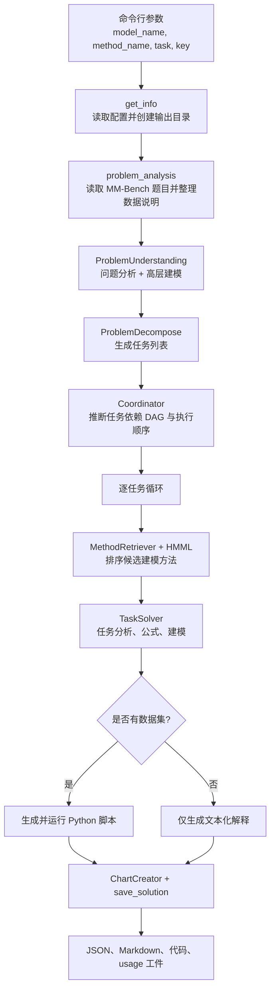

# MM-Agent 文档总览

MM-Agent 是一个面向真实世界数学建模问题的多阶段智能体运行时。一次运行并不是“问一句、答一句”这么简单，而是会依次完成：问题整理、任务拆解、方法检索、公式生成、代码生成与执行、图表生成，以及结果落盘。

> 本套文档以源码为准绳，不只是对 README 的转述。

## 30 秒建立整体直觉

## 哪些是仓库硬编码的，哪些是运行时生成的

**仓库中硬编码的部分**

- CLI 入口、配置加载、输出目录布局。
- 基于 DAG 的任务调度逻辑。
- HMML 的加载方式和分层检索框架。
- 代码执行、重试和工件持久化机制。
- MM-Bench 的评测脚本与分数汇总方式。

**运行时由 LLM 生成的部分**

- 问题分析与高层建模叙事。
- 子任务拆解文本。
- 面向具体任务的数学公式。
- 计算求解代码。
- 图表描述，以及可选的论文段落。

这点非常关键：MM-Agent **并没有把所有建模竞赛题的数学模型都提前写死**。它写死的是“如何挑模型、如何实例化模型”的工作流。

## 推荐阅读顺序

1. [快速开始](quick-start.md)：先跑起来，建立操作感。
2. [系统架构](architecture.md)：看整体骨架。
3. [执行流程](workflow.md)：看一次运行是如何层层推进的。
4. [数学与算法](math-theory.md)：看仓库里真正固定存在的数学逻辑。
5. [源码导读](source-guide.md)：需要对线源码时最快。
6. [评测说明](evaluation.md)：关注 benchmark 与复现时必读。

## 最值得记住的一句话

如果只记住一句，请记住：

> MM-Agent 本质上是一个**数学建模工作流引擎**，而不是一个只有单步输出的黑盒求解器。

## 主要源码锚点

- [`../../MMAgent/main.py`](../../MMAgent/main.py)
- [`../../MMAgent/utils/problem_analysis.py`](../../MMAgent/utils/problem_analysis.py)
- [`../../MMAgent/utils/mathematical_modeling.py`](../../MMAgent/utils/mathematical_modeling.py)
- [`../../MMAgent/utils/computational_solving.py`](../../MMAgent/utils/computational_solving.py)
- [`../../MMAgent/agent/retrieve_method.py`](../../MMAgent/agent/retrieve_method.py)
- [`../../MMAgent/agent/task_solving.py`](../../MMAgent/agent/task_solving.py)
- [`../../MMAgent/HMML/HMML.md`](../../MMAgent/HMML/HMML.md)
