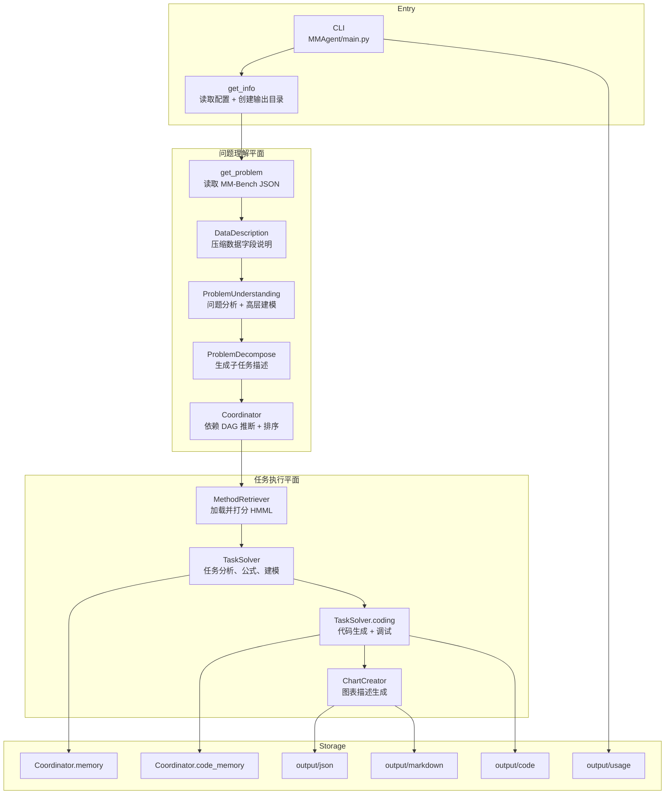

# 系统架构深潜

这一页回答的是一个核心问题：

**MM-Agent 到底由哪些真实模块组成，它们又是如何协作的？**

## 1. 宏观架构图

## 2. 六大子系统

| 子系统 | 关键文件 | 职责 |
| --- | --- | --- |
| CLI 与总控 | `MMAgent/main.py` | 建立整次运行、按顺序执行任务、保存 usage |
| 问题理解 | `utils/problem_analysis.py`、`agent/problem_analysis.py`、`agent/problem_decompse.py` | 把 MM-Bench 题目转成结构化问题摘要与任务列表 |
| 依赖调度 | `agent/coordinator.py` | 生成任务依赖 DAG，并做拓扑排序 |
| 方法检索 | `agent/retrieve_method.py`、`HMML/HMML.md` | 从分层方法库中选出候选建模方案 |
| 任务执行 | `utils/mathematical_modeling.py`、`utils/computational_solving.py`、`agent/task_solving.py` | 产出公式、建模过程、代码、结果和图表 |
| 评测系统 | `MMBench/evaluation/*.py` | 用 LLM 评估解答质量 |

## 3. 控制平面与数据平面

### 控制平面

控制平面负责决定“下一步做什么”，比如：

- 拆成几个任务，
- 哪些任务先做、哪些后做，
- 哪些建模方法值得考虑，
- 要不要进入代码执行分支，
- 代码失败后要不要继续 debug。

### 数据平面

数据平面负责承载“被处理的内容”，比如：

- MM-Bench 的题目 JSON，
- 数据集说明与数据文件，
- 生成出的任务描述，
- 生成出的公式与代码，
- 脚本执行结果，
- 保存下来的 JSON / Markdown 工件。

一句话概括：

> 控制平面决定工作流，数据平面承载题目内容。

## 4. 运行时最重要的内存状态

`Coordinator` 可以看成整次运行的轻量级状态中枢。

它主要维护三类状态：

- `DAG`：任务依赖关系。
- `memory`：每个已完成任务的文本产物。
- `code_memory`：每个任务的代码结构与输出文件摘要。

正因为有这三个内存区，后续任务才能“知道前面的任务已经做了什么”，而不需要引入更重的数据库或工作流引擎。

## 5. 为什么这个架构会显得“像 Agent”

因为里面叠了很多自我修正环：

- 问题分析会自我批判再改写，
- 公式生成会自我批判再改写，
- 代码生成失败后会继续调试，
- 图表生成会参考前面已生成的图表避免重复。

所以它不是简单直线流水线，而是一个**带反馈回路的流水线**。

## 6. 源码里隐藏的工程约束

这些点如果只看 README 很容易忽略：

- 生成脚本执行时默认加了 `CUDA_VISIBLE_DEVICES=0`，也就是默认只看见一个 GPU 槽位。
- 默认配置相对保守：`tasknum=4`、`top_method_num=6`、`chart_num=3`。
- 论文生成模块虽然存在，但在 `main.py` 中默认被注释掉，没有真正接进主流程。
- 这个仓库本质上是“一次性运行”的 in-memory 流程，不是长生命周期服务，也没有队列系统。

## 7. 工程上最实用的阅读顺序

如果你准备改 MM-Agent，推荐按下面顺序理解：

1. **入口与输出布局**：`main.py`、`utils.py`
2. **问题拆解**：`problem_analysis.py`、`problem_decompse.py`
3. **调度与检索**：`coordinator.py`、`retrieve_method.py`
4. **任务求解与代码执行**：`task_solving.py`、`computational_solving.py`
5. **评测系统**：`MMBench/evaluation/`

## 主要源码锚点

- [`../../MMAgent/main.py`](../../MMAgent/main.py)
- [`../../MMAgent/utils/problem_analysis.py`](../../MMAgent/utils/problem_analysis.py)
- [`../../MMAgent/utils/mathematical_modeling.py`](../../MMAgent/utils/mathematical_modeling.py)
- [`../../MMAgent/utils/computational_solving.py`](../../MMAgent/utils/computational_solving.py)
- [`../../MMAgent/agent/coordinator.py`](../../MMAgent/agent/coordinator.py)
- [`../../MMAgent/agent/retrieve_method.py`](../../MMAgent/agent/retrieve_method.py)
- [`../../MMAgent/agent/task_solving.py`](../../MMAgent/agent/task_solving.py)
