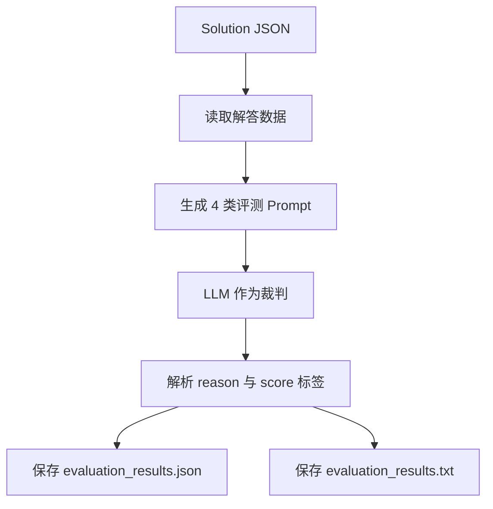
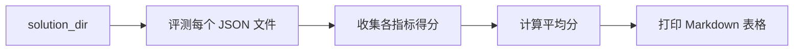

# 评测系统与 MM-Bench

MM-Agent 仓库自带一个配套 benchmark，名字叫 **MM-Bench**。这一页解释它的组织结构，以及仓库是如何对生成结果做评测的。

## 1. MM-Bench 里有什么

根据 `MMBench/README.md`，这个 benchmark 主要由四部分组成：

- `problem/`：以 JSON 存储的建模题目。
- `dataset/`：题目附带的数据集。
- `evaluation/`：评测脚本。
- `example_solution/`：样例解答。

## 2. 题目 JSON 的字段结构

一个题目 JSON 里通常会包含：

- `background`
- `problem_requirement`
- `dataset_path`
- `dataset_description`
- `variable_description`
- `addendum`

这个结构就是 benchmark 存储层与 agent 执行层之间的桥梁。

## 3. 单文件评测流程



单文件脚本会分别评四个维度：

- 问题分析质量，
- 建模严谨性，
- 实用性与科学性，
- 结果与偏差分析。

## 4. 分数是如何被提取出来的

评测脚本会从 LLM 输出里抓取以下标签：

- `<reason> ... </reason>`
- `<score> ... </score>`

如果 reason 和 score 的个数对不上，该部分就会返回空字典。

这说明评测虽然简单直接，但非常依赖 prompt 输出格式是否稳定。

## 5. 批量评测流程

`run_evaluation_batch.py` 会遍历目录中的所有 solution JSON，逐个评测后，再按指标汇总平均分。



最终表格会给出：

- Analysis Evaluation
- Modeling Rigorousness
- Practicality and Scientificity
- Result and Bias Analysis

## 6. 实际会用到的命令

评测单个文件：

```bash
python MMBench/evaluation/run_evaluation.py \
  --solution_file_path "MMBench/example_solution/example1.json" \
  --key "sk-..."
```

评测整个目录：

```bash
python MMBench/evaluation/run_evaluation_batch.py \
  --solution_dir "MMBench/example_solution" \
  --key "sk-..."
```

## 7. 评测结果保存在哪里

如果输入解答文件叫 `foo.json`，脚本会生成：

```text
<solution_dir>/evaluation_result/foo/
|- evaluation_results.json
`- evaluation_results.txt
```

其中：

- JSON 版本方便后续程序化分析，
- TXT 版本保留完整裁判叙述，更适合人工阅读。

## 8. 如何理解这个 benchmark 的评测哲学

MM-Bench 不是只看“最后答案像不像对的”。它更在意整个建模过程是否站得住脚：

- 问题是否理解正确，
- 模型是否严谨，
- 方案是否具有实践与科学价值，
- 结果分析是否考虑了偏差与局限。

这一点和 MM-Agent 的设计非常契合，因为 MM-Agent 本身就是一个分阶段建模系统，而不是只输出结论的一行答案机。

## 9. 使用时要记住的局限

- 评测器本身也是 LLM，所以结果会有一定波动。
- 由于解析依赖 XML 风格标签，输出格式不稳时容易影响结果。
- 平均分只适合看总体趋势，不能完全替代对文字理由的人工阅读。

## 主要源码锚点

- [`../../MMBench/README.md`](../../MMBench/README.md)
- [`../../MMBench/evaluation/run_evaluation.py`](../../MMBench/evaluation/run_evaluation.py)
- [`../../MMBench/evaluation/run_evaluation_batch.py`](../../MMBench/evaluation/run_evaluation_batch.py)
