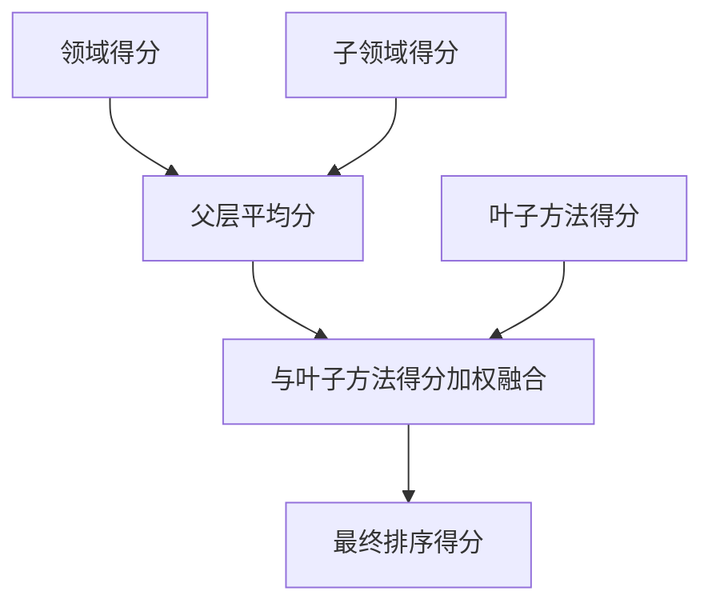
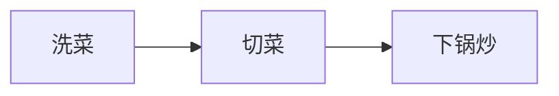

# 数学与算法原理解剖

这一页只讲一件事：

**仓库里真正被固定实现下来的数学与算法逻辑是什么。**

先说最重要的结论：

> MM-Agent 并没有把所有建模竞赛问题的最终数学模型预先写死。

具体题目的领域公式，大多是在运行时由 LLM 结合检索结果即时生成的。仓库里固定存在的数学，主要位于“元层”——也就是检索、调度、评测这些支撑层。

## 1. HMML 打分：既看“家族背景”，也看“当下表现”

在 `MethodScorer` 里，一个叶子方法的最终分数，是父层级分数与当前子节点分数的加权混合：

$$
\text{final\_score} = \alpha \cdot \text{parent\_avg} + \beta \cdot \text{child\_score}
$$

默认权重为：

$$
\alpha = 0.5,\qquad \beta = 0.5
$$

### 每个符号的现实意义

- `parent_avg`：更高层方法类别整体有多“像”当前任务。
- `child_score`：当前具体方法本身和任务有多匹配。
- `final_score`：最终用于排序的方法分数。

### 菜市场级数字例子

假设你在市场里选水果摊：

- 整个水果区口碑是 `80`
- 其中柑橘区口碑是 `70`
- 某个橙子摊今天新鲜度是 `90`

那么父层平均分就是：

$$
\text{parent\_avg} = \frac{80 + 70}{2} = 75
$$

最终分：

$$
\text{final\_score} = 0.5 \times 75 + 0.5 \times 90 = 82.5
$$

直觉上就是：这个摊子之所以值得选，不只是因为今天橙子新鲜，也因为它所在的大类和中类本身就靠谱。

## 2. 向量检索：本质是余弦相似度

`EmbeddingScorer` 会把任务描述和候选方法都编码成向量，再比较它们的方向有多接近。

概念公式是余弦相似度：

$$
\cos(\theta) = \frac{q \cdot m}{\|q\|\,\|m\|}
$$

其中：

- $q$ 是查询向量，也就是任务描述 embedding，
- $m$ 是候选方法的 embedding，
- 点积衡量的是二者方向是否一致。

代码里先做归一化，再做缩放后的点积。

### 生活化类比

想象桌上有两根箭头：

- 同方向，说明它们表达的意思很接近，相似度接近 `1`
- 垂直，说明关系不大，相似度接近 `0`
- 反方向，说明语义甚至相反，相似度会变成负数

一个超简单例子：

$$
q = (3,4), \qquad m = (6,8)
$$

两个向量方向完全一致，所以余弦相似度就是 `1`。

## 3. DAG 排序：先做前置，再做后置

`Coordinator.compute_dag_order()` 实现的是拓扑排序。

代码先计算每个节点的入度：

$$
\text{indegree}(v) = \text{任务 } v \text{ 的前置依赖个数}
$$

然后不断选出入度为 0 的任务来执行。

### 大白话解释

比如做饭：

1. 洗菜，
2. 切菜，
3. 下锅炒。

你不可能先炒再切。  
拓扑排序就是把这种“生活常识里的先后依赖”形式化。

如果图里存在环，就说明依赖自相矛盾，没有合法执行顺序。代码里会在这种情况下抛出 `ValueError`。

## 4. Critique-Improve 回路：不是一次生成，而是迭代修正

仓库里多个模块都遵循相同的抽象更新模式：

$$
x_{t+1} = \operatorname{Improve}(x_t, \operatorname{Critique}(x_t))
$$

这里：

- $x_t$ 是当前草稿，
- `Critique` 负责指出问题，
- `Improve` 根据批评意见生成更好的版本。

这个模式会出现在：

- 问题分析，
- 高层建模，
- 子任务公式生成。

通俗讲，就是系统不会“写完就走”，而是会主动给自己找茬，再改一版。

## 5. 代码执行回路：受限次数下的程序搜索

代码路径本身也是迭代型的。

可以粗略抽象成：

$$
\text{best\_program} = \operatorname{Debug}^k(\operatorname{Generate}(\text{prompt}))
$$

并且受固定尝试次数限制：

- 外层最多 `5` 次，
- 内层每次最多 `3` 轮 debug。

这不是严格意义上的数值优化器，但在工程行为上，它确实像是在“附近程序空间”里做一个有限搜索。

## 6. 评测均值：多个裁判，共用一个记分牌

在批量评测脚本中，会收集四大指标的得分，再取平均值。

平均数公式是：

$$
\bar{s} = \frac{1}{n}\sum_{i=1}^{n} s_i
$$

一个最朴素的数字例子：

如果某个 baseline 的四项分数分别是 `7, 8, 6, 9`，那么：

$$
\bar{s} = \frac{7+8+6+9}{4} = 7.5
$$

这就像同一份作业请了四位老师打分，最后取平均成绩。

## 7. 最值得记住的数学结论

这个仓库里被真正固定下来的数学，主要是在做三件事：

- **选方法**
- **排顺序**
- **验结果**

至于某一具体题目的领域公式，大多是运行时结合 Prompt 与 HMML 检索动态生成的。

也正因为如此，MM-Agent 才能跨不同题型保持相对灵活：它固定的是**决策框架**，而不是最终公式册。

## 主要源码锚点

- [`../../MMAgent/agent/retrieve_method.py`](../../MMAgent/agent/retrieve_method.py)
- [`../../MMAgent/utils/embedding.py`](../../MMAgent/utils/embedding.py)
- [`../../MMAgent/agent/coordinator.py`](../../MMAgent/agent/coordinator.py)
- [`../../MMAgent/agent/problem_analysis.py`](../../MMAgent/agent/problem_analysis.py)
- [`../../MMAgent/agent/task_solving.py`](../../MMAgent/agent/task_solving.py)
- [`../../MMBench/evaluation/run_evaluation_batch.py`](../../MMBench/evaluation/run_evaluation_batch.py)
