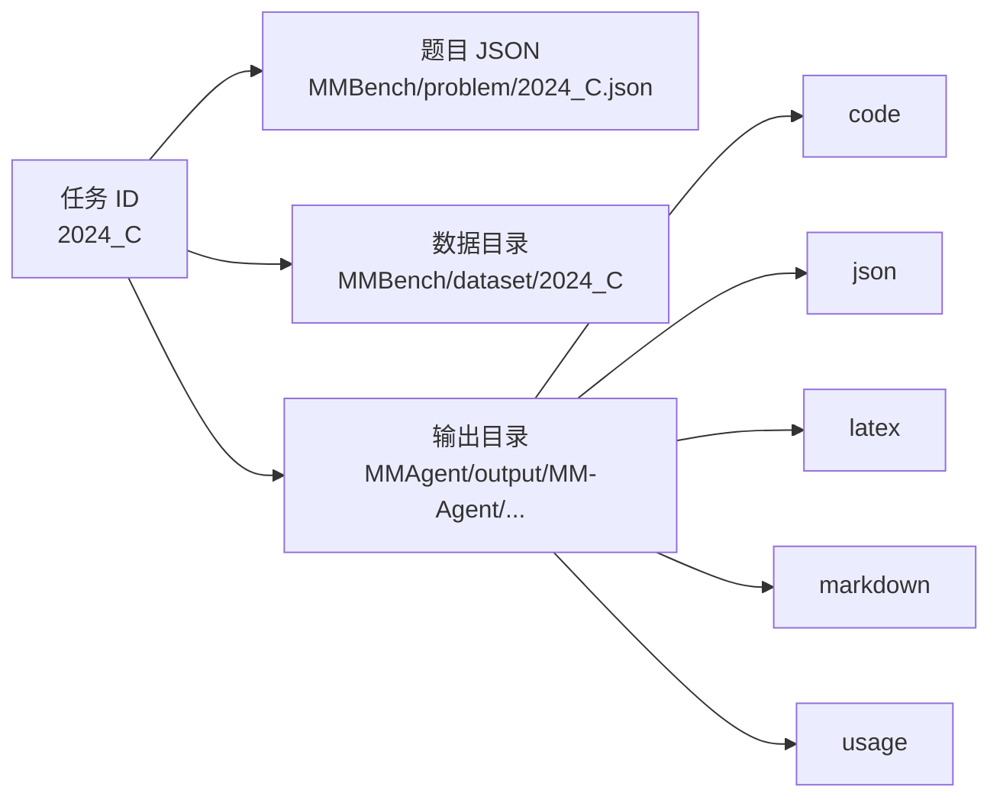

# 快速开始

这一页只做一件事：帮助你以最短路径把 MM-Agent 跑起来，并理解它的输入输出。

## 1. 安装依赖

仓库 README 推荐使用 Python 3.10，并建议使用 Conda。

```bash
uv sync --project .
```

## 2. 先启动本地中间件

Agent 只要求标准 OpenAI 兼容 `/v1` 接口。请先启动仓库内置中间件：

```bash
cd openai_compat_middleware
uv sync
cp .env.example .env
uv run openai-compat-middleware
```

启动后再回到仓库根目录运行 Agent。

## 3. 一定要在仓库根目录运行

命令请从仓库根目录执行，而不是进入 `MMAgent/` 之后再跑。

原因很朴素：代码里很多路径都是按“仓库相对路径”拼出来的，例如：

- `MMBench/problem/{task}.json`
- `MMBench/dataset/{task}`
- `MMAgent/output/{method_name}/{task}_{timestamp}`
- `MMAgent/code_template/main{task_id}.py`

如果你切到错误目录执行，很多路径都会直接失效。

## 4. 最小运行命令

```bash
uv run --project . python MMAgent/main.py --key "YOUR_API_KEY" --task "2024_C"
```

带显式默认值的写法如下：

```bash
uv run --project . python MMAgent/main.py \
  --key "sk-..." \
  --task "2024_C" \
  --model_name "gpt-5" \
  --method_name "MM-Agent"
```

## 5. CLI 参数逐个解释

| 参数 | 默认值 | 含义 |
| --- | --- | --- |
| `--model_name` | `gpt-5` | 传给 `LLM` 包装器的模型名 |
| `--method_name` | `MM-Agent` | 输出目录 `MMAgent/output/` 下的命名空间 |
| `--task` | `2024_C` | `MMBench/problem/` 下的题目 ID |
| `--key` | 空字符串 | 传给 LLM 包装器的 API Key |

如果 `--key` 为空，`LLM` 初始化时会直接抛出 `ValueError`。

## 6. API Base 是怎么选的

`MMAgent/llm/llm.py` 的逻辑是：

- 优先读取 `OPENAI_API_BASE`（建议本地设为 `http://127.0.0.1:4010/v1`）
- 若未设置，则默认 `https://api.openai.com/v1`

说得更接地气一点：

> Agent 始终使用标准 OpenAI 兼容接口；所有定制路由/头部都在中间件里处理。

## 7. 一次运行会在磁盘上产生什么

`get_info()` 会创建带时间戳的输出目录，`mkdir()` 会再补齐以下子目录：

```text
MMAgent/output/MM-Agent/2024_C_YYYYMMDD-HHMMSS/
|- code/
|- json/
|- latex/
|- markdown/
`- usage/
```



补充几点：

- 如果题目带数据集，数据目录会先被复制进 `output/code/`。
- 即便论文生成阶段默认未启用，`latex/` 目录也会被创建。
- usage 统计和总运行时间会写到 `usage/` 下。

## 8. 终端里大概会看到什么

运行时会打印清晰的阶段边界，例如：

- Stage 1: Problem Analysis
- Stage 2 & 3: Mathematical Modeling & Computational Solving
- 每个 Task 的 solving banner
- 最终 solution 与 token usage

所以它更像一个“小型流水线调度器”，而不是单轮问答工具。

## 9. 如何评测生成结果

评测单个解答：

```bash
uv run --project . python MMBench/evaluation/run_evaluation.py \
  --solution_file_path "path/to/solution.json" \
  --key "YOUR_API_KEY"
```

批量评测目录：

```bash
uv run --project . python MMBench/evaluation/run_evaluation_batch.py \
  --solution_dir "path/to/solution_dir" \
  --key "YOUR_API_KEY"
```

## 10. 常见故障排查

- 如果 import 失败，优先确认是否从仓库根目录执行。
- 如果 LLM 调用一开始就失败，检查 `--key` 和对应的环境变量。
- 如果代码生成成功但运行失败，去看 `output/code/` 里的脚本与输出。
- 如果某题没有数据集，MM-Agent 仍可走纯文本分析路径，只是不进入代码执行分支。

## 主要源码锚点

- [`../../README.md`](../../README.md)
- [`../../MMAgent/main.py`](../../MMAgent/main.py)
- [`../../MMAgent/utils/utils.py`](../../MMAgent/utils/utils.py)
- [`../../MMAgent/llm/llm.py`](../../MMAgent/llm/llm.py)
- [`../../MMBench/README.md`](../../MMBench/README.md)
