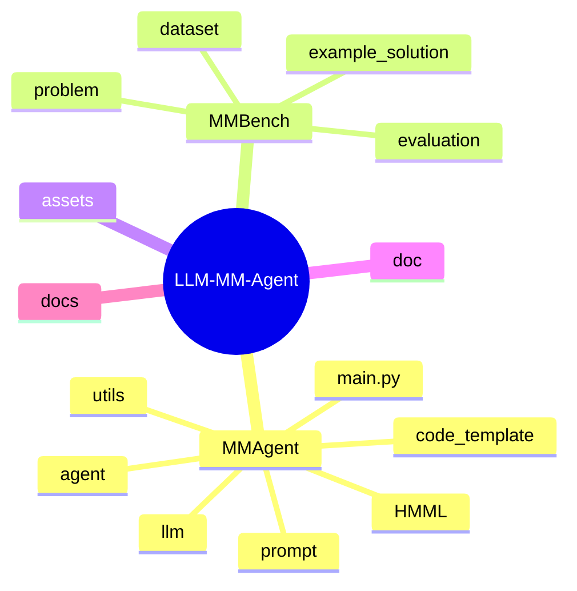

# 源码导读：工程师与研究者如何高效读这个仓库

如果你想高效理解这个项目，**不要随机翻文件**。最好的策略是先抓总控主干，再往两侧展开。

## 1. 目录结构脑图

## 2. 推荐阅读顺序

| 顺序 | 文件或目录 | 为什么先看它 |
| --- | --- | --- |
| 1 | `MMAgent/main.py` | 最短路径看完整执行链 |
| 2 | `MMAgent/utils/utils.py` | 配置加载、输出目录、持久化逻辑都在这里 |
| 3 | `MMAgent/utils/problem_analysis.py` | 看题目如何被变成结构化问题摘要 |
| 4 | `MMAgent/agent/problem_analysis.py` | 看 actor-critic 分析循环 |
| 5 | `MMAgent/agent/problem_decompse.py` | 看子任务如何被拆分与精修 |
| 6 | `MMAgent/agent/coordinator.py` | 看依赖推断与 DAG 排序 |
| 7 | `MMAgent/utils/mathematical_modeling.py` | 看依赖、检索、建模如何接起来 |
| 8 | `MMAgent/agent/retrieve_method.py` + `MMAgent/HMML/HMML.md` | 看方法检索核心与方法库本体 |
| 9 | `MMAgent/agent/task_solving.py` | 最大热点文件：公式、代码、调试、结果生成都在里面 |
| 10 | `MMAgent/utils/computational_solving.py` | 每个任务的工件组装点 |
| 11 | `MMAgent/utils/solution_reporting.py` | 可选论文生成子系统 |
| 12 | `MMBench/README.md` 与 `MMBench/evaluation/` | 看 benchmark 结构与评测流程 |

## 3. 想回答什么问题，就去看哪个文件

| 你想知道什么 | 最应该看哪里 |
| --- | --- |
| 怎么启动一次运行？ | `MMAgent/main.py` |
| 输出会保存到哪里？ | `MMAgent/utils/utils.py` |
| 问题 prompt 是怎么构造的？ | `MMAgent/utils/problem_analysis.py` |
| 子任务怎么拆的？ | `MMAgent/agent/problem_decompse.py` |
| 依赖关系怎么推断？ | `MMAgent/agent/coordinator.py` |
| HMML 方法怎么检索？ | `MMAgent/agent/retrieve_method.py` |
| 生成代码在哪里执行？ | `MMAgent/agent/task_solving.py` |
| JSON/Markdown 如何保存？ | `MMAgent/utils/utils.py` |
| 评测怎么做？ | `MMBench/evaluation/run_evaluation.py` |

## 4. 三个最值得重点读的设计文件

### `MMAgent/agent/task_solving.py`

这个文件是项目从“概念 demo”变成“真正在做事的系统”的关键节点。里面包含：

- 任务分析，
- 公式生成，
- 建模过程生成，
- 代码生成，
- 调试，
- 执行，
- 结果解释。

如果你只想精读一个非入口文件，那大概率就应该先读它。

### `MMAgent/agent/retrieve_method.py`

这个文件说明了 MM-Agent 不是纯 prompt 堆出来的系统。HMML 检索给了它一个明确的、结构化的方法选择框架。

### `MMAgent/utils/solution_reporting.py`

这个文件能看出项目的更大野心：不仅要“解题”，还想把结构化结果进一步写成论文风格报告。

## 5. 不同目标下的阅读建议

### 如果你想跑实验

建议按这个顺序看：

1. `README.md`
2. `MMAgent/main.py`
3. `MMAgent/utils/utils.py`
4. `MMBench/README.md`

### 如果你想改检索逻辑

建议先看：

1. `MMAgent/HMML/HMML.md`
2. `MMAgent/agent/retrieve_method.py`
3. `MMAgent/utils/embedding.py`

### 如果你想提升代码生成质量

建议先看：

1. `MMAgent/agent/task_solving.py`
2. `MMAgent/code_template/`
3. `MMAgent/utils/computational_solving.py`

### 如果你想增强最终报告生成

建议先看：

1. `MMAgent/utils/solution_reporting.py`
2. `MMAgent/utils/utils.py`
3. `MMAgent/prompt/` 下的 prompt 文件

## 6. 一个很好用的总口诀

理解这个仓库时，脑中把它一分为二会轻松很多：

- **运行时编排系统**：`MMAgent/`
- **Benchmark 与裁判系统**：`MMBench/`

剩下的目录大多都是支撑结构。

## 主要源码锚点

- [`../../MMAgent/main.py`](../../MMAgent/main.py)
- [`../../MMAgent/utils/utils.py`](../../MMAgent/utils/utils.py)
- [`../../MMAgent/agent/task_solving.py`](../../MMAgent/agent/task_solving.py)
- [`../../MMAgent/agent/retrieve_method.py`](../../MMAgent/agent/retrieve_method.py)
- [`../../MMAgent/utils/solution_reporting.py`](../../MMAgent/utils/solution_reporting.py)
- [`../../MMBench/README.md`](../../MMBench/README.md)
