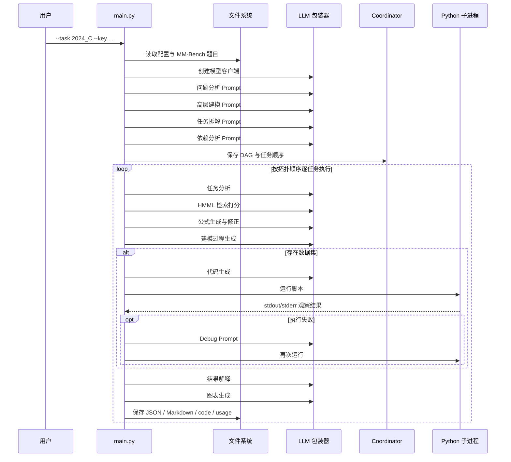

# 执行流程全链路拆解

这一页按照真实源码，把一次 `python MMAgent/main.py ...` 的运行从头拆到尾。

## 1. 阶段总览



## 2. Stage 0：先把输入正规化

`parse_arguments()` 只接收四个参数，但 `get_info()` 会把上下文迅速补全出来：

- 题目 JSON 路径，
- 数据目录路径，
- 带时间戳的输出目录，
- 所有后续步骤依赖的目录结构。

也就是说，CLI 输入很小，但运行时上下文很快就变得很丰富。

## 3. Stage 1：把题目整理成“机器可消费的问题简报”

`get_problem()` 会读取一个 MM-Bench JSON，并把以下内容拼成一个 prompt-ready 的问题描述：

- `background`
- `problem_requirement`
- `addendum`
- 如果存在数据集描述，则加入数据摘要

如果题目有数据字段说明，`DataDescription.summary()` 会先让 LLM 把原始字段表述压缩成更容易理解的数据总结。

直白点说，就是先把竞赛题文本，变成更像“顾问项目简报”的形式。

## 4. Stage 2：在拆任务之前先理解问题

`ProblemUnderstanding` 内部主要跑两步：

1. `analysis()`
2. `modeling()`

这两步都采用 actor -> critic -> improvement 模式。

这里的设计哲学非常重要：

> MM-Agent 不会一上来就写代码，而是先建立对问题结构的高层理解。

## 5. Stage 3：把整道题拆成多个子任务

`ProblemDecompose.decompose_and_refine()` 会先粗拆，再逐个 refine 每个子任务。

拆解原则依赖于题型和配置中的任务数量，这也是仓库里专门放 `decompose_prompt.json` 的原因：**任务拆分本身也是建模知识的一部分。**

## 6. Stage 4：推断任务依赖并确定执行顺序

`Coordinator.analyze_dependencies()` 会：

1. 让 LLM 分析任务依赖，
2. 尝试解析出 DAG，
3. 再做拓扑排序。

如果多次解析失败，代码会退化到一个链式 DAG：

- Task 1 无依赖，
- Task 2 依赖 Task 1，
- Task 3 依赖 Task 1 和 Task 2，
- 以此类推。

这个 fallback 很有工程味道：即便结构化输出不理想，流程也尽量不断。

## 7. Stage 5：每个任务先去 HMML 检索建模方法

在 `mathematical_modeling()` 中，MM-Agent 会先做任务分析，然后把“任务描述 + 任务分析”交给 `MethodRetriever`。

`MethodRetriever` 会读取 `HMML.md`，把分层 markdown 转成 JSON，再对候选方法做打分排序。

注意，它返回的还不是最终代码，而是一份**候选建模思路的排序清单**。

## 8. Stage 6：生成公式与建模过程文本

完成检索后，`TaskSolver.modeling()` 会做几件紧密耦合的事：

- 先生成初步公式，
- 再通过 critique 进行修正，
- 最后生成建模过程叙事。

这一阶段的本质问题是：

> “对于这个子任务，应该用什么数学视角去看，又应该如何把它讲清楚？”  

## 9. Stage 7：如果有数据，就生成、运行、调试代码

如果题目附带数据，`computational_solving()` 就会进入代码分支。

关键细节如下：

- 先选 `MMAgent/code_template/main{task_id}.py` 作为脚手架，
- 将生成代码保存到 `output/code/main{task_id}.py`，
- 在输出目录中执行该脚本，
- 捕获 stdout / stderr，
- 如果出现 traceback 类错误，就继续用 debugger prompt 修正并重跑。

控制结构可以粗略理解为：

```text
外层最多尝试 5 次
  内层每次最多 debug 3 轮
```

所以 MM-Agent 的行为更像一个会自我纠错的工程师，而不是静态代码生成器。

## 10. Stage 8：解释结果并生成图表

代码跑完之后，任务并不算结束。系统还会继续写出：

- `solution_interpretation`
- `subtask_outcome_analysis`
- 图表描述

然后 `save_solution()` 再把整个 solution 对象同时写成 JSON 和 Markdown。

## 11. Stage 9：可选论文生成

仓库里其实已经有 `generate_paper()`，以及相当完整的论文大纲生成逻辑，位置在 `utils/solution_reporting.py`。

但 `main.py` 中真正调用它的代码被注释掉了。

因此当前仓库最准确的理解方式是：

- **分阶段求解与工件落盘已经完整打通**
- **最终论文生成能力已经写出大半，但默认没有接入主链路**

## 12. 为什么默认任务 `2024_C` 很适合做演示

默认任务 `2024_C` 是网球 momentum 问题，带逐分级数据，例如：

- `match_id`
- `set_no`
- `game_no`
- `point_victor`
- `server`
- `rally_count`
- `speed_mph`

这类题非常适合作为 MM-Agent 的 showcase，因为它天然要求系统把以下能力连起来：

- 问题理解，
- 时间序列 / 状态演化思维，
- 事件级特征使用，
- 代码执行，
- 图表可视化，
- 解释性写作。

## 主要源码锚点

- [`../../MMAgent/main.py`](../../MMAgent/main.py)
- [`../../MMAgent/utils/problem_analysis.py`](../../MMAgent/utils/problem_analysis.py)
- [`../../MMAgent/utils/mathematical_modeling.py`](../../MMAgent/utils/mathematical_modeling.py)
- [`../../MMAgent/utils/computational_solving.py`](../../MMAgent/utils/computational_solving.py)
- [`../../MMAgent/agent/problem_analysis.py`](../../MMAgent/agent/problem_analysis.py)
- [`../../MMAgent/agent/problem_decompse.py`](../../MMAgent/agent/problem_decompse.py)
- [`../../MMAgent/agent/coordinator.py`](../../MMAgent/agent/coordinator.py)
- [`../../MMBench/problem/2024_C.json`](../../MMBench/problem/2024_C.json)
